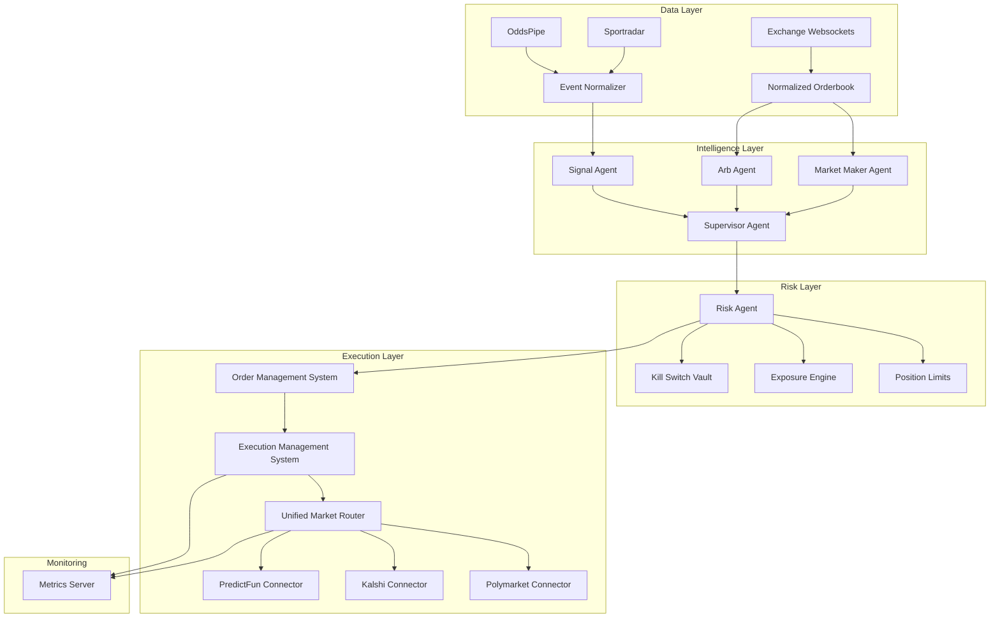

# Architecture Graph

```mermaid
graph TD
    subgraph Data Layer
        O[OddsPipe] --> DN[Event Normalizer]
        S[Sportradar] --> DN
        WS[Exchange Websockets] --> OB[Normalized Orderbook]
    end

    subgraph Intelligence Layer
        DN --> SA[Signal Agent]
        OB --> MA[Market Maker Agent]
        OB --> AA[Arb Agent]
        SA --> SUP[Supervisor Agent]
        MA --> SUP
        AA --> SUP
    end

    subgraph Risk Layer
        SUP --> RK[Risk Agent]
        RK --> PL[Position Limits]
        RK --> EE[Exposure Engine]
        RK --> KS[Kill Switch Vault]
    end

    subgraph Execution Layer
        RK --> OMS[Order Management System]
        OMS --> EMS[Execution Management System]
        EMS --> UMR[Unified Market Router]
        UMR --> PC[Polymarket Connector]
        UMR --> KC[Kalshi Connector]
        UMR --> PFC[PredictFun Connector]
    end

    subgraph Monitoring
        EMS --> MET[Metrics Server]
        UMR --> MET
    end
```
